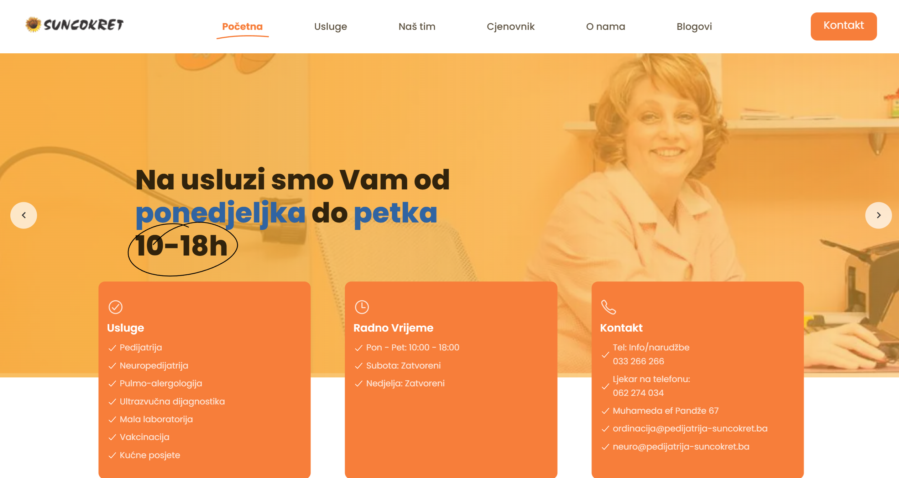
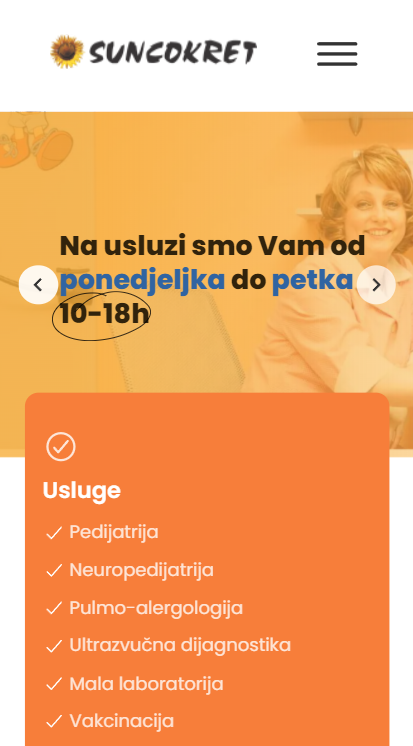

# Suncokret Pedijatrija: Pediatric Healthcare Website

[Live Demo](https://pedijatrija-suncokret.ba/)

## Project Description

Suncokret Pedijatrija is a professional website developed for a pediatric healthcare center. The platform provides detailed information about the clinic's services, team, and contact details. Designed with families in mind, the website ensures a welcoming and easy-to-navigate experience.

---

## Features

- **Clinic Information**: Highlights the services provided by the clinic.
- **Team Profiles**: Introduces the team of pediatricians and their specialties.
- **Contact Form**: Allows parents to book appointments or make inquiries.
- **Responsive Design**: Ensures usability across desktop, tablet, and mobile devices.

---

## Technologies Used

- **HTML5**: For structuring the content.
- **CSS3**: For styling and layout.
- **JavaScript**: For interactivity and enhanced user experience.

---

## Setup Instructions

To run this project locally, follow these steps:

1. Clone the repository:

   ```bash
   git clone https://github.com/AndNijaz/SuncokretPedijatrija.git
   ```

2. Navigate to the project directory:

   ```bash
   cd SuncokretPedijatrija
   ```

3. Open `http://localhost:3000` in your browser to view the project.

---

## Usage

The website is designed for:

- **Parents and Families**: Accessing pediatric healthcare services and information.
- **Clinic Staff**: Managing bookings and inquiries through the contact form.
- **Visitors**: Learning about the clinic and its team.

---

## Screenshots

### Desktop View



### Mobile View



> _Screenshots are stored in the `/img` directory._

---

## Project Status

This project is **live and operational**. Future updates may include:

- Adding an online booking system for appointments.
- Expanding content to include health tips and articles for parents.
- Enhancing accessibility and SEO features.

---

## Acknowledgements

This project was developed to support the Suncokret Pediatric Clinic in providing accessible healthcare information to families. Special thanks to the clinic team for their collaboration and input.

---
